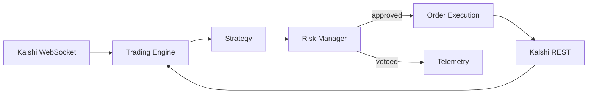

<p align="center">
  
</p>

<h1 align="center">Kalshi Trading Bot</h1>

<p align="center">
  <strong>Open-source algorithmic trading framework for <a href="https://kalshi.com">Kalshi</a> prediction markets.</strong><br>
  Backtest, paper-trade, and deploy event-contract strategies in Python.
</p>

<p align="center">
  <em>Built and maintained by <a href="https://viprasol.com">Viprasol Tech</a> — Fintech Experts. Full-Stack Builders.</em>
</p>

<p align="center">
  <a href="https://github.com/Viprasol-Tech/kalshi-trading-bot/actions/workflows/ci.yml"></a>
  <a href="LICENSE"></a>
  
  
  <a href="https://t.me/viprasol_help"></a>
  <a href="https://github.com/Viprasol-Tech/kalshi-trading-bot/stargazers"></a>
</p>

---

> ## ⚠️ Disclaimer
> This software is for **educational purposes only**. Do not risk money which you are afraid to lose. **USE THE SOFTWARE AT YOUR OWN RISK. THE AUTHORS AND ALL AFFILIATES ASSUME NO RESPONSIBILITY FOR YOUR TRADING RESULTS.**
>
> Nothing in this repository constitutes **financial, investment, legal, or tax advice**. Trading prediction markets and event contracts involves substantial risk, including the **total loss of capital**. Backtest results are **not indicative of future performance**. The bundled example strategies are illustrative and are **not** expected to be profitable.
>
> Always start in **dry-run / paper-trading mode** and understand every mechanism before committing real funds. Comply with [Kalshi's Terms of Service](https://kalshi.com/tos) and all laws in your jurisdiction. **Viprasol Tech is not affiliated with or endorsed by Kalshi.**

---

## ✨ Features

- 🔐 **Kalshi-native auth** — correct RSA-PSS request signing (API key ID + RSA private key), the current Kalshi standard.
- 🌐 **Async REST client** — market data, order book, balance, positions, order create/cancel.
- 📡 **WebSocket streaming** — real-time `orderbook_delta`, `ticker`, `trade`, `fill` channels.
- 🧠 **Pluggable strategies** — subclass one `Strategy` base class; ship your own.
- 🛡️ **Risk manager** — pre-trade limits + fractional-Kelly position sizing.
- 🧪 **Backtester** — replay snapshots through any strategy and get metrics.
- 🏜️ **Dry-run by default** — orders are simulated until you explicitly go `--live`.
- 🖥️ **Typer CLI** — `kalshi-bot markets`, `balance`, `run`.
- 🌎 **Demo + production** environments, fully configurable base URLs.
- ⚙️ **Modern tooling** — `pyproject.toml`, ruff, mypy (strict), pytest, Docker, GitHub Actions, mkdocs.

## 🚀 Quickstart

### Option A — Docker

```bash
git clone https://github.com/Viprasol-Tech/kalshi-trading-bot.git
cd kalshi-trading-bot
cp .env.example .env          # then edit .env with your Kalshi API key ID
docker compose run --rm bot markets --status open --limit 10
```

### Option B — pip / local

```bash
git clone https://github.com/Viprasol-Tech/kalshi-trading-bot.git
cd kalshi-trading-bot
python -m pip install -e ".[dev]"
cp .env.example .env

# Public market data needs no credentials:
kalshi-bot markets --status open --limit 10

# Dry-run a strategy (no real orders are sent):
kalshi-bot run momentum INXD-23DEC29-B5000 --ticks 5
```

## 🔑 Getting Kalshi credentials

1. Create a key in the Kalshi dashboard → **Profile → API Keys**. You receive an **API Key ID** and a one-time **RSA private key** download.
2. Save the private key as `./secrets/kalshi_private_key.pem` (this path is git-ignored).
3. Put your key ID in `.env`:

```dotenv
KALSHI_API_KEY_ID=your-key-id-uuid
KALSHI_PRIVATE_KEY_PATH=./secrets/kalshi_private_key.pem
KALSHI_ENVIRONMENT=demo        # 'demo' (sandbox) or 'prod'
KALSHI_DRY_RUN=true
```

> 🔒 **Never commit your private key or `.env`.** See [SECURITY.md](SECURITY.md).

## 🏗️ Architecture



| Module | Responsibility |
|---|---|
| `kalshi_bot.exchange` | REST client, WebSocket, RSA-PSS auth, typed models |
| `kalshi_bot.core` | Trading engine / poll loop |
| `kalshi_bot.strategies` | `Strategy` base + bundled examples |
| `kalshi_bot.risk` | Pre-trade limits + Kelly sizing |
| `kalshi_bot.backtesting` | Snapshot replay + metrics |
| `kalshi_bot.telemetry` | Logging & notifications |

## ✍️ Writing a strategy

```python
from kalshi_bot.exchange.models import Action, OrderRequest, OrderType, Side
from kalshi_bot.strategies.base import Strategy, StrategyContext


class BuyCheapYes(Strategy):
    name = "buy_cheap_yes"

    def on_market_data(self, ctx: StrategyContext) -> list[OrderRequest]:
        m = ctx.market
        if m.yes_ask is not None and m.yes_ask < 20 and ctx.position_for(m.ticker) == 0:
            return [OrderRequest(
                ticker=m.ticker, action=Action.BUY, side=Side.YES,
                count=1, type=OrderType.LIMIT, yes_price=m.yes_ask,
            )]
        return []
```

Every order is routed through the risk manager before it can be submitted. See [docs/strategies.md](docs/strategies.md).

## 🧪 Development

```bash
python -m pip install -e ".[dev]"
ruff check . && ruff format --check .
mypy src
pytest
```

## 🗺️ Roadmap

- [x] RSA-PSS authenticated REST client
- [x] WebSocket market-data streaming
- [x] Strategy plugin system + examples
- [x] Risk manager with Kelly sizing
- [x] Backtester
- [ ] Live order reconciliation & fills feed
- [ ] SQLite/Parquet market-data recorder
- [ ] Telegram/Discord notifications
- [ ] Web dashboard
- [ ] Hyperparameter optimisation

## 🤝 Contributing

PRs welcome! Read [CONTRIBUTING.md](CONTRIBUTING.md) and our [Code of Conduct](CODE_OF_CONDUCT.md). Have a strategy idea or a bug? [Open an issue](https://github.com/Viprasol-Tech/kalshi-trading-bot/issues).

## 📬 Contact — Viprasol Tech Private Limited

- 🌐 Website: [viprasol.com](https://viprasol.com)
- ✉️ Email: [support@viprasol.com](mailto:support@viprasol.com)
- 💬 Telegram: [t.me/viprasol_help](https://t.me/viprasol_help) · 📱 WhatsApp: +91 96336 52112
- 🐙 GitHub: [@Viprasol-Tech](https://github.com/Viprasol-Tech) · 💼 [LinkedIn](https://www.linkedin.com/in/viprasol/) · 𝕏 [@viprasol](https://twitter.com/viprasol)
- 📈 TradingView: [@viprasol](https://in.tradingview.com/u/viprasol/) · MQL5: [viprasol](https://www.mql5.com/en/users/viprasol)

> *Viprasol Tech — Fintech software development, algorithmic trading systems, MT4/MT5 bots, AI voice agents, and B2B SaaS. Need a custom trading system? [Get in touch](mailto:support@viprasol.com).*

## 📄 License

[MIT](LICENSE) © 2025 Viprasol Tech Private Limited
