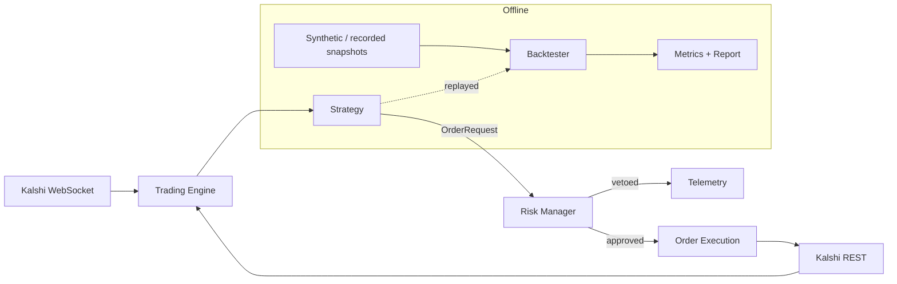

<p align="center">
  
</p>

<h1 align="center">Kalshi Trading Bot</h1>

<p align="center">
  <strong>Open-source algorithmic trading framework for <a href="https://kalshi.com">Kalshi</a> prediction markets.</strong><br>
  Backtest, paper-trade, and deploy event-contract strategies in Python — with real metrics, real risk controls, and dry-run by default.
</p>

<p align="center">
  <em>Built and maintained by <a href="https://viprasol.com">Viprasol Tech</a> — Fintech Experts. Full-Stack Builders.</em>
</p>

<p align="center">
  <a href="https://github.com/Viprasol-Tech/kalshi-trading-bot/actions/workflows/ci.yml"></a>
  <a href="LICENSE"></a>
  
  
  
  
  
  <a href="https://t.me/viprasol_help"></a>
  <a href="https://github.com/Viprasol-Tech/kalshi-trading-bot/stargazers"></a>
</p>

---

> ## ⚠️ Disclaimer
> This software is for **educational purposes only**. Do not risk money which you are afraid to lose. **USE THE SOFTWARE AT YOUR OWN RISK. THE AUTHORS AND ALL AFFILIATES ASSUME NO RESPONSIBILITY FOR YOUR TRADING RESULTS.**
>
> Nothing in this repository constitutes **financial, investment, legal, or tax advice**. Trading prediction markets and event contracts involves substantial risk, including the **total loss of capital**. Backtest results are **not indicative of future performance** — they are a sanity check on *logic*, computed on simplified fills with no queue, slippage, or settlement modelling. The bundled example strategies are illustrative and are **not** expected to be profitable.
>
> Always start in **dry-run / paper-trading mode** and understand every mechanism before committing real funds. Comply with [Kalshi's Terms of Service](https://kalshi.com/tos) and all laws in your jurisdiction. **Viprasol Tech is not affiliated with or endorsed by Kalshi.**

---

## ✨ Features

- 🔐 **Kalshi-native auth** — correct RSA-PSS request signing (API key ID + RSA private key), the current Kalshi standard.
- 🌐 **Async REST client** — market data, order book, balance, positions, order create/cancel.
- 📡 **WebSocket streaming** — real-time `orderbook_delta`, `ticker`, `trade`, `fill` channels.
- 🧠 **Five bundled strategies** — `market_maker`, `momentum`, `mean_reversion`, `arbitrage`, and Kelly-sized `fair_value`.
- 🧩 **Pluggable strategy API** — subclass one `Strategy` base class and ship your own in minutes.
- 🛡️ **Risk manager** — pre-trade limits + fractional-Kelly position sizing, configurable from the environment.
- 📊 **Backtester with real metrics** — Sharpe, max drawdown, volatility, win rate, profit factor, fees, and per-trade PnL.
- 🎲 **Offline synthetic data** — backtest and demo with zero network or credentials.
- 🧱 **Typed models** — `Market`, `OrderBook`, `Fill`, `Position`, `Portfolio` (pydantic v2 throughout).
- 🏜️ **Dry-run by default** — orders are simulated until you explicitly go `--live`.
- 🖥️ **Rich Typer CLI** — `markets`, `balance`, `run`, `backtest`, `strategies`, `version`.
- 🌎 **Demo + production** environments with fully configurable base URLs.
- ⚙️ **Modern tooling** — `pyproject.toml`, ruff, mypy (strict), pytest, Docker, GitHub Actions, mkdocs.

## 🚀 Quickstart

### Option A — Docker

```bash
git clone https://github.com/Viprasol-Tech/kalshi-trading-bot.git
cd kalshi-trading-bot
cp .env.example .env          # then edit .env with your Kalshi API key ID
docker compose run --rm bot markets --status open --limit 10
```

### Option B — pip / local

```bash
git clone https://github.com/Viprasol-Tech/kalshi-trading-bot.git
cd kalshi-trading-bot
python -m pip install -e ".[dev]"
cp .env.example .env

# No credentials needed — backtest a strategy on offline synthetic data:
kalshi-bot backtest momentum --ticks 200

# List the bundled strategies:
kalshi-bot strategies

# Public market data needs no credentials either:
kalshi-bot markets --status open --limit 10

# Dry-run a live strategy (no real orders are sent):
kalshi-bot run momentum INXD-23DEC29-B5000 --ticks 5
```

A backtest prints a metrics table like this:

```text
   Backtest: momentum (200 ticks)
+----------------------------------+
| Metric                  |  Value |
|-------------------------+--------|
| Trades                  |     36 |
| Net PnL                 | $-0.40 |
| Total return            | -0.04% |
| Sharpe (annualised)     | -2.712 |
| Max drawdown            |  0.04% |
| Win rate                | 16.67% |
| Profit factor           |  0.149 |
+----------------------------------+
```

## 🔑 Getting Kalshi credentials

1. Create a key in the Kalshi dashboard → **Profile → API Keys**. You receive an **API Key ID** and a one-time **RSA private key** download.
2. Save the private key as `./secrets/kalshi_private_key.pem` (this path is git-ignored).
3. Put your key ID in `.env`:

```dotenv
KALSHI_API_KEY_ID=your-key-id-uuid
KALSHI_PRIVATE_KEY_PATH=./secrets/kalshi_private_key.pem
KALSHI_ENVIRONMENT=demo                       # 'demo' (sandbox) or 'prod'
KALSHI_DRY_RUN=true
KALSHI_RISK__MAX_CONTRACTS_PER_ORDER=100      # nested risk limits, override any
KALSHI_RISK__KELLY_FRACTION=0.25
```

> 🔒 **Never commit your private key or `.env`.** See [SECURITY.md](SECURITY.md).

## 🏗️ Architecture



| Module | Responsibility |
|---|---|
| `kalshi_bot.exchange` | REST client, WebSocket, RSA-PSS auth, typed models (`Market`, `OrderBook`, `Fill`, `Position`, `Portfolio`) |
| `kalshi_bot.core` | Trading engine / poll loop |
| `kalshi_bot.strategies` | `Strategy` base + five bundled examples |
| `kalshi_bot.risk` | Pre-trade limits + fractional-Kelly sizing |
| `kalshi_bot.backtesting` | Snapshot replay, synthetic data, metrics, rich report |
| `kalshi_bot.config` | Typed pydantic settings (env + `.env`, nested risk limits) |
| `kalshi_bot.telemetry` | Logging & notifications |

## 🧰 CLI reference

| Command | What it does |
|---|---|
| `kalshi-bot version` | Print the installed version. |
| `kalshi-bot strategies` | List the bundled example strategies. |
| `kalshi-bot backtest <strategy>` | Backtest on offline synthetic data and print metrics. |
| `kalshi-bot markets` | List Kalshi markets (public, no credentials). |
| `kalshi-bot balance` | Show your portfolio balance (requires credentials). |
| `kalshi-bot run <strategy> <ticker>` | Run a strategy live or in dry-run (default). |

## ✍️ Writing a strategy

```python
from kalshi_bot.exchange.models import Action, OrderRequest, OrderType, Side
from kalshi_bot.strategies.base import Strategy, StrategyContext


class BuyCheapYes(Strategy):
    name = "buy_cheap_yes"

    def on_market_data(self, ctx: StrategyContext) -> list[OrderRequest]:
        m = ctx.market
        if m.yes_ask is not None and m.yes_ask < 20 and ctx.position_for(m.ticker) == 0:
            return [OrderRequest(
                ticker=m.ticker, action=Action.BUY, side=Side.YES,
                count=1, type=OrderType.LIMIT, yes_price=m.yes_ask,
            )]
        return []
```

Every order is routed through the risk manager before it can be submitted. See [docs/strategies.md](docs/strategies.md).

## 📊 Backtesting in code

```python
from kalshi_bot.backtesting.data import random_walk_snapshots
from kalshi_bot.backtesting.engine import Backtester
from kalshi_bot.strategies.examples.mean_reversion import MeanReversion

snapshots = random_walk_snapshots(n=250, seed=42)          # offline, deterministic
report = Backtester(starting_balance_cents=100_000, fee_cents_per_contract=1).run(
    MeanReversion(window=20, z=1.5), snapshots,
)

print(report.summary())
# {'trades': ..., 'sharpe': ..., 'max_drawdown': ..., 'win_rate': ..., 'profit_factor': ...}
```

Run [`examples/backtest_demo.py`](examples/backtest_demo.py) to benchmark all five strategies at once. More in [docs/backtesting.md](docs/backtesting.md).

## 🧪 Development

```bash
python -m pip install -e ".[dev]"
ruff check . && ruff format --check .
mypy src
pytest
```

The project is **mypy-strict** and ships **56 tests** covering auth, models, risk, all five strategies, the backtester (fills, PnL, fees, risk gating), the metrics, the config, and the CLI.

## 🗺️ Roadmap

- [x] RSA-PSS authenticated REST client
- [x] WebSocket market-data streaming
- [x] Strategy plugin system + five examples
- [x] Risk manager with Kelly sizing
- [x] Backtester with Sharpe / drawdown / win-rate metrics
- [x] Offline synthetic-data generator + `backtest` CLI command
- [ ] Live order reconciliation & fills feed
- [ ] SQLite/Parquet market-data recorder
- [ ] Telegram/Discord notifications
- [ ] Web dashboard
- [ ] Hyperparameter optimisation

## ❓ FAQ

**Does this place real trades out of the box?**
No. Everything defaults to **dry-run** — orders are logged, not sent. You must pass `--live` and configure valid credentials to trade for real.

**Do I need a Kalshi account to try it?**
No. `kalshi-bot backtest` and the examples run fully offline on synthetic data, and `kalshi-bot markets` reads public data without credentials.

**Are the bundled strategies profitable?**
No — they are educational references for the API and risk plumbing. Treat any backtest number as a logic check, not a forecast.

**How do I change risk limits?**
Set `KALSHI_RISK__*` environment variables (e.g. `KALSHI_RISK__MAX_CONTRACTS_PER_ORDER=50`) or construct `RiskLimits` directly in code.

**Which Python versions are supported?**
3.11, 3.12, and 3.13.

## 🤝 Contributing

PRs welcome! Read [CONTRIBUTING.md](CONTRIBUTING.md) and our [Code of Conduct](CODE_OF_CONDUCT.md). Have a strategy idea or a bug? [Open an issue](https://github.com/Viprasol-Tech/kalshi-trading-bot/issues).

## Contact — Viprasol Tech Private Limited

- Website: [viprasol.com](https://viprasol.com)
- Email: [support@viprasol.com](mailto:support@viprasol.com)
- Telegram: [t.me/viprasol_help](https://t.me/viprasol_help) | WhatsApp: +91 96336 52112
- GitHub: [@Viprasol-Tech](https://github.com/Viprasol-Tech) | [LinkedIn](https://www.linkedin.com/in/viprasol/) | X [@viprasol](https://twitter.com/viprasol)

> *Viprasol Tech — Fintech software development, algorithmic trading systems, MT4/MT5 bots, AI voice agents, and B2B SaaS. Need a custom trading system? [Get in touch](mailto:support@viprasol.com).*

## License

[MIT](LICENSE) (c) 2025 Viprasol Tech Private Limited
